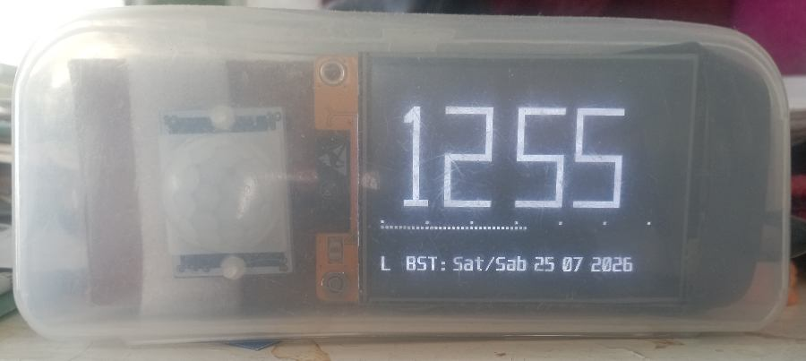
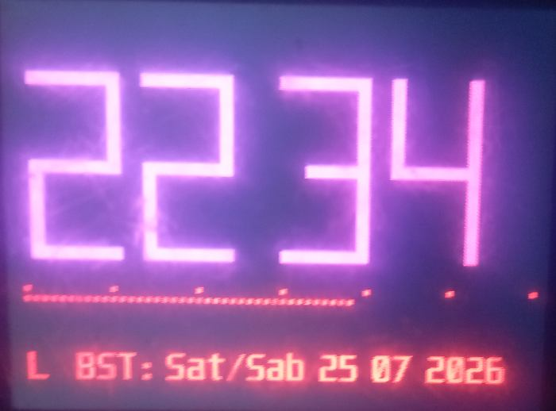
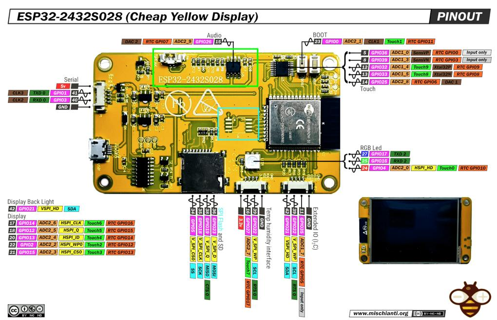
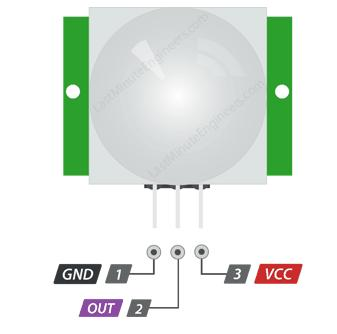
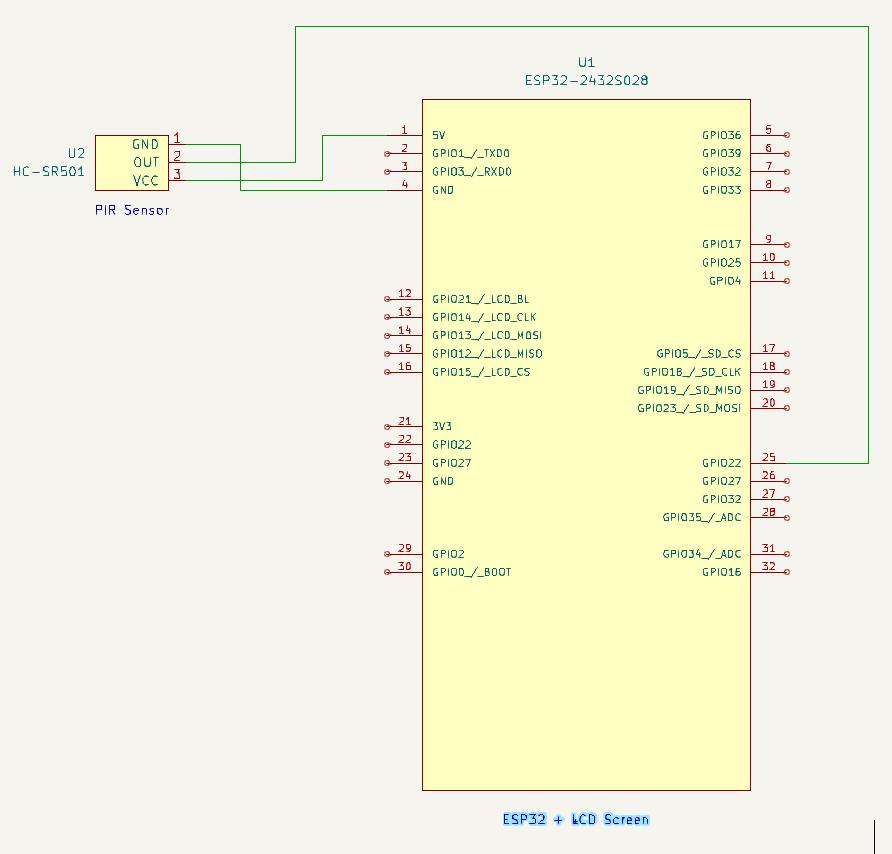

# amclok

A MicroPython-based electronic project using an ESP32 processor with integrated LCD screen

## Equipment



The assembled project showing daytime display.

## Project Overview

This project uses an ESP32/LCD combo board to display accurate time, perfect for a bedside environment.

## Features

* Automatic NTP time synchronisation
* Day and night display modes with fade in
* Motion-activated display short period activation
* Smartphone browser used to configure Wi-Fi credentials
* Daylight-saving adjustment automatic
* Modular MicroPython design

## Importance of Sleep

Getting enough sleep is essential for good physical and mental health. Adults generally need around 7–9 hours of sleep each night, although individual needs vary. Good sleep helps the body recover, supports memory and concentration, improves mood, and helps maintain a healthy immune system.

A regular sleep routine can make it easier to get the quality sleep you need. Try to go to bed and wake up at roughly the same time each day, including at weekends. A consistent routine helps your body clock settle into a natural rhythm. Creating a relaxing bedtime routine, reducing screen use before bed, and avoiding caffeine late in the day can also help.

Making sleep a regular priority is not a luxury—it is an important part of looking after your health and maintaining energy and wellbeing throughout the day.

Red and blue light can have quite different effects on our brains and sleep patterns.  
Blue light, especially from screens, is more likely to suppress melatonin, the hormone that helps prepare us for sleep. It can make us feel more alert and awake, which is useful during the day but less helpful in the evening.

Red light has much less effect on melatonin and the body's internal clock, so it is generally considered more sleep-friendly at night. It can provide enough illumination to move around or read without strongly signalling to the brain that it is daytime.

The brightness of the light also matters — a very bright light of any colour can be stimulating, while dimmer lighting is generally better for preparing for bed.

To summarise:   
BLUE light tends to encourage alertness and activity.  
RED (dim) or warm light is more conducive to winding down and sleep.  

  
Clock display fading from daytime operation to nighttime operation

## Main Components

- Touchscreen 2.8inch TFT LCD Display ESP-WROOM-32 ILI9341 Resistive Touch Module 240 * 320 ESP32-2432S028R Bluetooth WIFI
320x240 pixels (cost £10.59 Nov 2025)

- HC-SR501 PIR Motion Sensor Module Infrared IR Pyroelectric Detector ESP32 Nano (cost £2.95 Nov 2025)

- Cable USB A or C to USB C to fit ESP32 board.

- Case. We used a spectacle case that was almost transparent. It works well on travels.


## Software

- MicroPython
- Comprises a main program that makes use of shared modules.

## Circuit

  
ESP32-2432S028R  

  
HC-SR501 PIR Sensor  

  
AMCLOK Circuit  

## How It Works

On startup AMCLOK logs onto the designated WiFi Hotspot periodically synchronising the ESP32 onboard clock.
The Passive Infra Red (PIR) detector illuminates the screen showing the time for a few seconds.
A seconds bar shows how far into each minute we are.

## Installation

Plug AMCLOK lead into laptop USB port. Open Thonny. At bottom right expect to see similar to "Micropython (ESP32) * USB Serial @ /dev/ttyUSB0"  
On left-hand under 'MicroPython device' a list of files saved on flash should show.  
On power up the special file main.py is run; it is sufficient that this contains just one line 'import amclok'.  
Before any file manipulation stop program execution with "Run/Interrupt execution".  
To temporarily disable main.py auto start comment out its content to '#import amclok' remembering to restore it before going operational.  
With main.py disabled test run by ensuring amclok.py is showing and currently selected then use Run/Run current script.  

Before leaving Thonny do "Run/Disconnect", then unplug the serial USB port.  

## Configuration
Some modules need setting up. A header in each module gives notes on set up.

1) **modWiFi**  
wifi_entries.dat holds WiFi connection credentials. Contents comprise a List of one line Entries.    
Each Entry is like:   
SSID::PASSWORD::Region  
SSID and PASSWORD can contain a large range of characters including a space character.    
Region is a single uppercase letter. L=London time, P=Paris time and E=Edit.    
The file is saved in ESP32 flash.  
The first Entry should always be as below.  
When travelling to edit the List put your smartphone into Portable Hotspot mode and setup a temporary hotspot with EPlace as SSID and password to your choosing.  
AMCLOK scans down the List and if it finds it can connect to EPlace then it will setup an edit method on your phone's browser.  
So initially, assuming UK based, fill wifi_entries.dat with two Entries/lines as below:   
EPlace::PASSWORD1::E  
SSID::PASSWORD2::L  
SSID and PASSWORD2 are  typically as setup on your home router.  

2) **modDateTime**  
Write the daylight saving string defined at the start of the module
into a file named "dst.rule" and save in ESP32 flash.

## Files in flash and Checksums
To see all filenames loaded in flash run below in Thonny Shell noting both lines can be entered together:  
import os  
print(os.listdir())  

```
>>> import os  
print(os.listdir()) 
['Unispace12x24.c', 'amclok.py', 'boot.py', 'dst.rule', 'ili9341.py', 'main.py', 'modDateTime.py', 'modKeepAlive.py', 'modWiFi.py', 'wifi_entries.dat', 'xglcd_font.py']
>>> 
```

$ md5sum filename  
8c5d657886f1768bf67091619c46ed11  Unispace12x24.c  
ee00f014f306727d53b6e4e51974273d  amclokV016.py  
7bcccd3ba4a55f93898ed3dbf646b8ab  ili9341.py  
6e6b172c27e95ef5001bb5d41e179b62  main.py  
4a18a3774c4eb155312a4c7f1c8ccca0  modDateTimeV010.py  
d8fa630fd1014bdc0ac31bc1f3fc39ad  modKeepAliveV002.py  
8f3724022d35732e6761accb9a089f9b  modWiFiV017.py  
ee88333dcbb909062574abbf0c62c0e8  xglcd_font.py  

